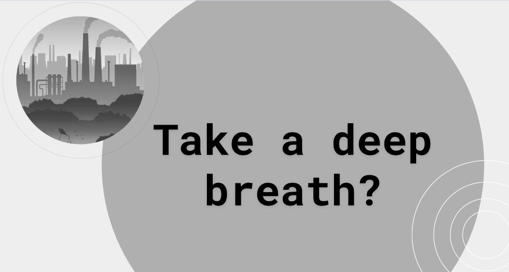

# TAKE A DEEP BREATH?
Particulate matter prediction based on meteorological open source sensor data using time series analysis.

At the end of our 12-week-data-science-bootcamp stood the capstone project. A time of practice and continued learning. We four found together due to our concern for ecological topics and our interest in time series analysis. This repo holds our joint work of round about three weeks.

## Topic
Air pollution is causing millions of premature deaths worldwide. Even in Germany the particulate matter (PM) concentrations are repeatedly classified as unhealthy by the EU. In this project we evaluate geographical and seasonal impacts on PM concentrations for two German cities. Furthermore, we implement a 7-day PM forecast for 64 different locations within these cities. This forecast is based on current open source PM sensor data, weather data and forecasted weather data and can be extended across Germany.
## Data
We took into account three data sources:
* Historic to up-to-date  particulate matter (PM) values for various locations all over the world are provided together with several weather data by the [Sensor Community](https://sensor.community/en/).
* Historic to up-to-date weather data for around 500 cities in Germany are provided by [Deutscher Wetterdienst](https://opendata.dwd.de/climate_environment/CDC/observations_germany/).
* Weather forecast based on Deutscher Wetterdienst data is provided by [meteomatix](https://www.meteomatics.com/de/).

For sure we couldn't use the whole enormous amount of data. Actually we spend quit a lot of time to figure out how to clean the sensor community data properly and to accept that only PM measurement are usable for us. Because of the shortness of time, we limited our analysis to two areas in Germany: Frankfurt(Main) and Bremen. Still we made sure, that the data processing steps can easily be adapted to other areas in Germany.
## Structure
This repo holds the following folders and information/results:
* [data](https://github.com/j-herbig/air-pollution/tree/main/data): Download folder for the data.
* [models](https://github.com/j-herbig/air-pollution/tree/main/modeling): Holds the config file for model tracking by means of MLflow.
* [notebooks](https://github.com/j-herbig/air-pollution/tree/main/notebooks): Jupyter Notebooks and python files to download, clean, merge, analyze and visualize the data as follows:

| Notebook / Python File | Purpose|
|---|---|
| download_Deutscher_Wetterdinest.ipynb | download training weather data until now |
| download_sensor_community.ipynb | download PM training data |
| download_sensor_community_update_data.ipynb | update training PM data until now |
| download_weather_forecast.ipynb | download future weather data |
| meteomatics_download.py | download future weather data |
| data_merging.ipynb | merge and preprocess weather and PM data |
| EDA.ipynb | exploratory data analysis and data cleaning |
| location_plot.ipynb | overview of investigated 64 locations |
| baseline.ipynb | baseline model for PM forecast |
| prophet_single_location.ipynb | (fast) PM forecast for only one location |
| config.py | configuration file for an interactive keplergl map |
| prophet_all_locations_mlflow_images.ipynb | PM forecast for all 64 locations tracked with MLflow for model tuning and images saved |
| rmse_analysis.ipynb | error analysis with data downloaded from MLflow|
| future_predictions.ipynb | PM forecast for all 64 locations and visualization of results with keppler.gl |
| future_predictions_cv.ipynb | PM forecast for all 64 locations and cross validation  |
| future_predictions_presentation.ipynb | PM forecast for all 64 locations and generation of graphs for presentation |

* [presentations](https://github.com/j-herbig/air-pollution/tree/main/presentations): Brief overview of our results given as a midterm and a final presentation for our pretended stakeholder Deutscher-Städte-und-Gemeindebund.
* [protocols](https://github.com/j-herbig/air-pollution/tree/main/protocols): We did a proper project management and recorded the discussions that where necessary at the beginning.  
* [statistics](https://github.com/j-herbig/air-pollution/tree/main/statistics): Download folder for statistics (RMSE) from MLflow.
* data_update.py: Executable file to bring the data up to date.


## Requirements

- pyenv with Python: 3.9.4

### Setup

Use the requirements file in this repo to create a new environment.

```BASH
make setup

#or

pyenv local 3.9.4
python -m venv .venv
source .venv/bin/activate
pip install --upgrade pip
pip install -r requirements.txt
brew install proj
pip install pyproj
pip install keplergl == 0.2.0
```

